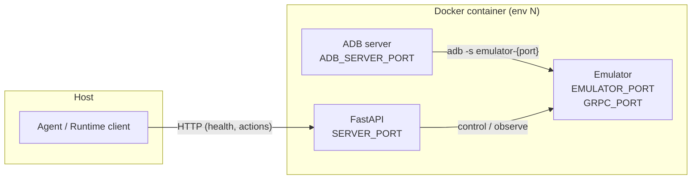
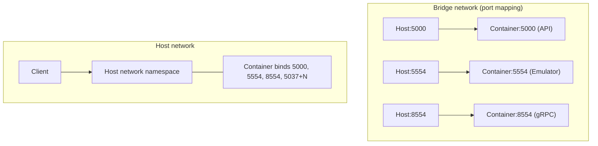

# Android Docker Container: Ports and Host Connectivity

This document describes the ports used inside the Android Docker container and how they connect to the host in **bridge** vs **host** network modes.

---

## Concepts: Linux server, localhost, and why unique ports

**Linux server** = the single machine (physical or VM) where Docker and your Python processes (trainer, inference, agent) run. We will call this the **host**.

**localhost** = the loopback address `127.0.0.1` on that host. There is **one** localhost per machine. Any process on the host can open a connection to `localhost:<port>` to talk to a service bound on that port on the same machine.

**Why unique ports per container?**  
On the host there is a single TCP port space. Two processes cannot bind to the same port. So we assign **one set of ports per container** (server, emulator, gRPC, ADB). With host network, each container’s server binds to a different port (5001, 5002, 5004, …). The trainer (or any process on the host) then **sends messages** by calling `http://localhost:5001/...`, `http://localhost:5002/...`, etc. — each port identifies one container’s API.

**Does sending messages require host network?**  
No. With **bridge** network we could publish ports (`-p 5001:5001`, `-p 5002:5002`, …) and the host could still use `localhost:5001` to reach env0. We use **host network** mainly for: (1) **Multiple ADB servers** — each container needs its own ADB daemon on a different port (`5037 + env_id`); with host network this is straightforward. (2) **One addressing model** — any process (on the host or in a host-network container) uses the same `localhost:<port>` for every env. (3) **No NAT** — no port mapping layer, which can simplify debugging and avoid some edge cases.

**Diagram: one host, one localhost, many ports → one port per container**

```
                    Linux server (host)
    ┌─────────────────────────────────────────────────────────────────┐
    │  localhost (127.0.0.1) — single port space on this machine      │
    │                                                                  │
    │   5001    5002    5004    5037    5038    5574    5576   ...    │
    │    │       │       │       │       │       │       │             │
    │    ▼       ▼       ▼       ▼       ▼       ▼       ▼             │
    │  env0    env1    env2   ADB env0 ADB env1 emu0   emu1   ...      │
    │  server  server  server                                            │
    └─────────────────────────────────────────────────────────────────┘
         ▲       ▲       ▲
         │       │       │   "Send message" = HTTP to localhost:<port>
         │       │       │   e.g. GET http://localhost:5001/health
         │       │       │       POST http://localhost:5002/step
         └───────┴───────┴────── Trainer / agent / runtime client (on host)
    ```

Each container (env0, env1, …) binds its **server** to a **unique** port on that same localhost. The client picks the env by port: 5001 → env0, 5002 → env1, etc.

---

## Why ADB, emulator, and gRPC ports? (Agent only uses server port)

The **agent** talks only to the **server port** (HTTP API: reset, step, /health). The other ports are used **inside** the container so the server can drive the emulator:

| Port type | Who uses it | Purpose |
|-----------|-------------|---------|
| **Server port** | Agent → Server | HTTP API. Only port the agent needs. |
| **ADB port** | Server (Python) → ADB daemon | The server runs `adb -P 5037+env_id ...` to send commands (tap, swipe, shell, etc.). The ADB **daemon** listens on this port; one daemon per container so they don’t clash. |
| **Emulator (console) port** | ADB daemon → Emulator | The emulator is started with `-port 5574` (etc.). ADB connects to it as `emulator-5574`. Each container needs its own emulator port so multiple emulators don’t clash. |
| **gRPC port** | Server / AndroidWorld lib → Emulator | The emulator is started with `-grpc 8554` (etc.). The AndroidWorld stack uses gRPC for some emulator features (e.g. snapshot, sensors). One gRPC port per container. |

So the data flow inside one container is:

```
  Agent  ──HTTP──►  Server (FastAPI)  ──adb -P ADB_PORT -s emulator-CONSOLE_PORT──►  ADB daemon  ──►  Emulator (console port)
                         │
                         └── gRPC ──►  Emulator (gRPC port)
```

We assign **unique** ADB / emulator / gRPC ports per container so that when many containers run (especially with host network), their ADB daemons and emulators don’t bind to the same port on the host.

**Where are these ports? (localhost vs “inside container”)**

- **Host network:** The container shares the host’s network. So **every** port (server, ADB, emulator, gRPC) is on the **same localhost** (the host). The ADB port is unique **on localhost** (5037, 5038, 5039, …) so multiple ADB daemons don’t clash. The **agent** only talks to the **server port**; that is the only interface between the agent and the container. After the HTTP request reaches the server process, the server uses other ports (ADB, emulator, gRPC) on that same localhost to talk to the ADB daemon and emulator — the message is already “inside” the container only in the sense that the server process is running in the container; the ports it uses are still the host’s ports.

- **Bridge network:** The container has its own network. The **host** only sees the **server port** (via Docker port publish, e.g. host:5001 → container:5001). ADB / emulator / gRPC ports exist only **inside** the container’s network (each container can use 5037, 5574, 8554 inside itself without clashing with another container). So the **server port is the only interface between localhost (host) and each container**; the rest are internal to the container.

**Why do we need unique localhost ports if ADB is “inside” the container?**  
With **host network**, “inside the container” does **not** mean a separate network. The container shares the host’s network namespace, so when the ADB daemon (or server, emulator) **binds to a port**, it is binding on the **host’s** port. Two containers cannot both bind ADB to 5037 on the same machine, so we use 5037, 5038, 5039, … on localhost. With **bridge** network, each container has its own network, so each can have ADB on 5037 *inside* that container with no clash; we don’t need unique ADB ports on localhost there.

---

## Pros and cons: host vs bridge

| Aspect | Host network | Bridge network |
|--------|--------------|----------------|
| **Network namespace** | Container shares host’s network; no separate container IP. | Each container has its own network namespace and IP (e.g. 172.17.0.x). |
| **Port allocation** | Every service (server, ADB, emulator, gRPC) must use a **unique port on the host**. Many ports per container × N containers. | Only **published** ports appear on the host (e.g. server port). ADB/emulator/gRPC can reuse the same port numbers inside each container. |
| **Multiple ADB daemons** | Natural: each container’s ADB binds to `5037 + env_id` on the host; no clash. | Each container can run ADB on 5037 *inside* the container. If the host must run `adb -P X` to a specific container, you must publish each container’s 5037 to a different host port (same idea as host, but via publish). |
| **Addressing** | One model: any process (host or host-network container) uses `localhost:5001`, `localhost:5002`, … for every env. | Host uses `localhost:5001` (or published ports). If the agent runs in another container, it must use the host’s IP or a shared Docker network to reach the Android containers. |
| **NAT / port mapping** | None. All bind directly on the host. | Docker NAT and port publishing; rare edge cases (e.g. connection limits, source port) can occur. |
| **Isolation & security** | No network isolation: containers can bind to any host port and see host network traffic. | Better isolation: containers have private IPs; only explicitly published ports are reachable from the host. |
| **Debugging** | Simple: `curl localhost:5001/health`, `ss -tlnp \| grep 5001`. All ports visible on the host. | Need to know published mapping; internal ports (ADB, emulator) not visible on host unless published. |
| **Parallel creation** | Works once you assign unique host ports per env (server, ADB, emulator, gRPC). Resource contention (CPU/RAM) can still limit how many start at once. | Same; port clashes are avoided by container isolation. Resource contention still applies. |
| **When to use** | Single host, many envs, simple “everything on localhost” addressing; or when you need multiple ADB daemons on the host. | When you want network isolation, fewer host ports, or the agent runs in a container and you’re fine with Docker networking. |

**Summary**

- **Host:** One network (localhost), simple addressing, multiple ADB daemons easy; you must manage many unique host ports and give up network isolation.
- **Bridge:** Isolated networks, fewer host ports, better isolation; addressing from another container or host needs a bit more setup (publish ports, host IP or shared network).

---

## Ports Inside the Container

Each container runs:

| Component | Env var | Default / formula | Purpose |
|-----------|---------|-------------------|--------|
| **FastAPI server** | `SERVER_PORT` | 5000 + 2×env_id | HTTP API (actions, observations, `/health`) |
| **Android emulator console** | `EMULATOR_PORT` | 5574 + 2×env_id | Emulator console (e.g. 5554, 5576) |
| **Emulator gRPC** | `GRPC_PORT` | EMULATOR_PORT + 3000 | gRPC for emulator control |
| **ADB server** | `ADB_SERVER_PORT` | 5037 (bridge) or 5037 + env_id (host) | ADB daemon for device/emulator |

The **entrypoint** starts: `adb -P ${ADB_SERVER_PORT:-5037} devices`, then `python -m server.server`, which binds to `SERVER_PORT` and starts the emulator on `EMULATOR_PORT` / `GRPC_PORT`.

---

## High-Level Diagram: Container ↔ Host

```
┌─────────────────────────────────────────────────────────────────────────────────┐
│                           HOST MACHINE                                            │
│                                                                                   │
│   Host ports (bridge mode)     OR     Host = container (host network mode)        │
│   e.g. 5000, 5554, 8554              e.g. 5000, 5576, 8576, 5038                  │
│         │                                    │                                     │
│         │ port mapping /                     │ same network namespace              │
│         ▼                                    ▼                                     │
│   ┌─────────────────────────────────────────────────────────────────────────┐    │
│   │                  DOCKER CONTAINER (env0, env1, ...)                      │    │
│   │                                                                          │    │
│   │   ┌──────────────────┐  ┌──────────────────┐  ┌──────────────────┐     │    │
│   │   │ FastAPI server   │  │ Android emulator  │  │ ADB server        │     │    │
│   │   │ SERVER_PORT      │  │ EMULATOR_PORT     │  │ ADB_SERVER_PORT   │     │    │
│   │   │ (e.g. 5000)      │  │ (e.g. 5554)      │  │ (5037 or 5037+N)  │     │    │
│   │   │                  │  │ GRPC_PORT (8554) │  │                   │     │    │
│   │   └────────┬─────────┘  └────────┬─────────┘  └────────┬─────────┘     │    │
│   │            │                      │                     │               │    │
│   │            │  /health, actions    │  emulator console   │  adb devices  │    │
│   │            │  observations        │  gRPC               │               │    │
│   └────────────┼──────────────────────┼─────────────────────┼───────────────┘    │
│                │                      │                     │                     │
└────────────────┼──────────────────────┼─────────────────────┼─────────────────────┘
                 │                      │                     │
                 ▼                      ▼                     ▼
         Host localhost:SERVER_PORT  Host:EMULATOR_PORT   Host:ADB_SERVER_PORT
         (client uses this for API)  (optional external)  (host mode: 5037+env_id)
```

---

## Mode 1: Bridge Network (port mapping)

Containers use the default bridge network. Ports are **published** from container to host so that **host:port → container:port** (same port number).

```
  HOST                                    CONTAINER (env0)
  ────                                    ────────────────
  localhost:5000  ──publish──►   container:5000   (FastAPI)
  localhost:5554  ──publish──►   container:5554   (emulator console)
  localhost:8554  ──publish──►   container:8554   (emulator gRPC)

  ADB_SERVER_PORT = 5037 (default). Only one ADB server per host; parallel
  containers use different SERVER/EMULATOR/GRPC ports; ADB inside container
  talks to emulator on localhost (container network).
```

**From `container_manager.py` (`_create_with_port_mapping`):**

```python
ports={
    f"{server_port}/tcp": server_port,
    f"{emulator_port}/tcp": emulator_port,
    f"{grpc_port}/tcp": grpc_port,
}
```

So the **host** sees the same port numbers (e.g. 5000, 5574, 8574). The **agent/runtime** connects to `http://localhost:{server_port}/health` and the API.

---

## Mode 2: Host Network

Containers use `network_mode="host"`: they share the **host network namespace**. There is no separate container network; everything binds directly on the host.

```
  HOST (and container, same network)
  ─────────────────────────────────
  localhost:5000   ← FastAPI (env0)
  localhost:5002   ← FastAPI (env1)
  localhost:5554   ← Emulator env0
  localhost:5576   ← Emulator env1
  ...
  localhost:5037   ← ADB server env0 (ADB_SERVER_PORT=5037)
  localhost:5038   ← ADB server env1 (ADB_SERVER_PORT=5038)
```

Each container gets **unique** `SERVER_PORT`, `EMULATOR_PORT`, `GRPC_PORT`, and **`ADB_SERVER_PORT = 5037 + env_id`** so multiple containers can run in parallel without port clashes. The host (and any process on the host) reaches services at `localhost:<port>`.

---

## Mermaid: Data Flow (Host → Container)



---

## Mermaid: Bridge vs Host Network



---

## Summary

| Aspect | Bridge | Host network |
|--------|--------|---------------|
| **Network** | Bridge; ports published to host | Host; container = host network |
| **Host access** | `localhost:SERVER_PORT` (mapped) | `localhost:SERVER_PORT` (direct) |
| **ADB** | One ADB (5037) per host; per-container emulator ports | Per-container ADB: `5037 + env_id` |
| **Use case** | Single or few containers | Parallel containers (e.g. pool), or tasks needing host ports (e.g. SMS) |

**Why SMS-related tasks mention “temporary / dynamic ports”:**  
SMS tasks (send, receive, reply) often need a **helper service** on the host that simulates or injects messages (e.g. fake SMS into the emulator via its console, or a small HTTP server the test harness talks to). That service may bind to a **port chosen at runtime** (e.g. the next free port when it starts) — a “temporary” or “dynamic” port, not a fixed one like 5001. The container (or the task setup) must then **communicate with that host service** on whatever port it got. With **host network**, the container sees the same localhost as the host, so it can reach `localhost:<dynamic_port>` as long as the port is passed in (e.g. env var). With **bridge**, the container’s localhost is its own; reaching a host service on an unknown port is awkward (you’d need the host’s IP and to pass the port, or to publish a port you don’t know in advance). So SMS (and similar tasks that depend on host-exposed services on non-fixed ports) are a reason to use host network.

**Root cause of “only 5/18 ready” with host network:**  
The **android_env** library (used inside the container) builds the ADB client config with a **default adb_server_port=5037** and does **not** read `ADB_SERVER_PORT` from the environment (it even removes `ANDROID_ADB_SERVER_PORT` in `AdbController.__init__`). So every container’s Python server was talking to the ADB daemon on **5037** (env0’s). With many emulators and one daemon, only the first few containers could complete setup before timeouts/“device offline”; the rest failed. The fix is to **inject the per-container ADB port** into the controller config: in `docker/android/server/env.py`, `_patch_get_controller_for_adb_port()` patches `get_controller` so that it builds `AdbControllerConfig` with `adb_server_port=int(os.environ["ADB_SERVER_PORT"])`. Rebuild the Docker image (e.g. v9) so the server uses the patched env.py.

Port allocation is done by `PortAllocator.preallocate_ports()` in `container_manager.py`; `ContainerFactory` passes `(server_port, emulator_port, grpc_port)` and, in host mode, `ADB_SERVER_PORT=5037+env_id` into the container environment.
