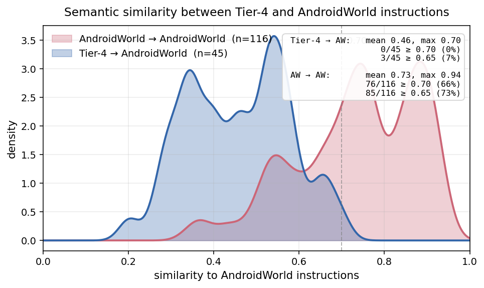
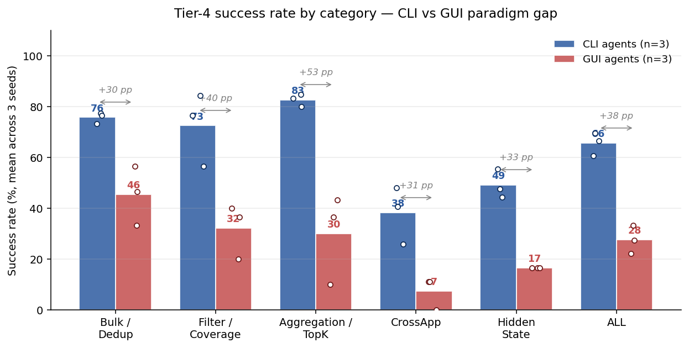

# Tier-4 vs. AndroidWorld — Novelty + Paradigm-Gap Analysis

This doc combines two complementary pieces of evidence that Tier-4 is
**non-redundant coverage** that AndroidWorld lacks:

1. **Semantic novelty** of the task instructions (no leakage from AW
   via rephrased goals).
2. **Paradigm gap** in agent performance (the task content requires CLI
   skills AW's GUI-focused tasks don't exercise).

**Headlines:**

- Instruction novelty: every Tier-4 task has nearest-neighbour cosine
  similarity below 0.70 to any AndroidWorld task (mean **0.46**); 42 / 45
  below 0.65; 40 / 45 below 0.60; 15 / 45 below 0.40. Hidden-State (E) is
  the most novel category (mean nearest-neighbour similarity 0.29).
- Paradigm gap: across 3 CLI vs 3 GUI agents × 3 seeds, the CLI paradigm
  leads by **+38 pp** overall — and the gap is consistent across all 5
  categories (B +30 pp, C +40 pp, A +53 pp, D +31 pp, E +33 pp).





---

## 1. Methodology

| component | choice |
|---|---|
| **Embedding model** | OpenAI `text-embedding-3-large` (3072-dim) |
| **Tier-4 source** | 45 task instructions from `eval-runners/data/tier4/realistic_subset_seed{7,30,1234}.jsonl` (the seed-instantiated `task` field) |
| **AndroidWorld source** | All **116** tasks from `android_world.registry.TaskRegistry.ANDROID_WORLD_FAMILY`, instantiated by setting `random.seed(s)` before `cls.generate_random_params()` and formatting via `cls.template` (or `cls(params).goal` for tasks whose template is a `@property`) |
| **Seeds** | 7, 30, 1234 — the same seeds used in the Tier-4 evaluation |
| **Pairwise metric** | Cosine similarity, same-seed pairing, averaged across the 3 seeds. For Tier-4 task *i* and AndroidWorld task *j*: $\mathrm{sim}(i,j) = \frac{1}{3} \sum_{s \in \{7,30,1234\}} \cos\!\big(\mathbf{e}^{(s)}_i,\, \mathbf{e}^{(s)}_j\big)$ |
| **Per-Tier-4 novelty score** | `max_sim(i) = max_j sim(i, j)` — the similarity of task *i* to its nearest AndroidWorld neighbour |
| **Determinism** | embeddings are cached by SHA-256 of the input string; re-runs are free |

The metric is conservative: a single AndroidWorld task that happens to share
template structure with a Tier-4 task already pushes the nearest-neighbour
score up. The fact that **no** Tier-4 task crosses 0.70 against **any** of
the 116 AndroidWorld tasks is therefore the strongest possible "novel
coverage" claim from this kind of analysis.

Source: `failure_analysis/_tools/tier4_vs_androidworld_similarity.py`
(reproducer; requires `OPENAI_API_KEY`).

---

## 2. Headline distribution

### 2.1 Histogram of `max_sim` over 45 Tier-4 tasks

```
[0.0, 0.2)    0
[0.2, 0.3)    5  █████
[0.3, 0.4)   10  ██████████
[0.4, 0.5)   11  ███████████
[0.5, 0.6)   14  ██████████████
[0.6, 0.7)    5  █████
[0.7, 0.8)    0
[0.8, 1.0)    0
```

### 2.2 Aggregate stats

| stat | value |
|---|---|
| mean `max_sim` | **0.457** |
| median | 0.459 |
| stdev | 0.121 |
| min | 0.202 |
| max | **0.698** |
| p25 / p75 | 0.347 / 0.552 |
| p90 | 0.599 |

### 2.3 Threshold counts (tasks with `max_sim` below threshold = "novel by that cutoff")

| threshold | tasks below | fraction |
|---|---|---|
| < 0.40 | 15 / 45 | **33 %** |
| < 0.50 | 26 / 45 | **58 %** |
| < 0.60 | 40 / 45 | **89 %** |
| < 0.70 | 45 / 45 | **100 %** |

---

## 3. Per-category breakdown

| cat | label | n | mean `max_sim` | median | min | max |
|---|---|---|---|---|---|---|
| **B** | Bulk / Dedup | 10 | 0.529 | 0.552 | 0.371 | 0.669 |
| **C** | Filter / Coverage | 10 | 0.404 | 0.374 | 0.285 | 0.574 |
| **A** | Aggregation / TopK | 10 | 0.507 | 0.530 | 0.292 | 0.698 |
| **D** | CrossApp | 9 | 0.488 | 0.486 | 0.401 | 0.558 |
| **E** | Hidden State | 6 | **0.295** | 0.316 | 0.202 | 0.336 |

**Reading:**

- **Hidden State (E)** is the most novel category — its nearest AW
  neighbours are unrelated tasks like `OpenAppTaskEval` and
  `TurnOnWifiAndOpenApp` (similarities 0.20-0.34). AndroidWorld has
  essentially zero coverage of `dumpsys` / `/proc` / `appops`-derived
  queries.
- **Filter / Coverage (C)** is the second-most novel (mean 0.40) —
  multi-condition queries across content providers are not in AW.
- **Bulk / Dedup (B)** has the most overlap with AW (mean 0.53), because
  AW has several Expense/Calendar bulk-action tasks. Even so, no Tier-4
  Bulk task crosses 0.67 — and the bulk-mutation predicate in each Tier-4
  task is structurally different (e.g. `WHERE amount < 100` vs. AW's
  "delete a specific named expense").

---

## 4. Top-10 highest-similarity pairs (least-novel Tier-4 tasks)

These are the Tier-4 tasks closest to *something* in AndroidWorld. Even
the maximum (0.70) is well below the 0.85+ region typical of "paraphrased
duplicates" in text-embedding-3-large.

| Tier-4 task | cat | nearest AW task | sim |
|---|---|---|---|
| Tier4AggregationOpenTracksWeeklyStats (21) | A | SportsTrackerLongestDistanceActivity | **0.698** |
| Tier4BulkDeleteCalendarTestEvents (32) | B | SimpleCalendarDeleteEventsOnRelativeDay | 0.669 |
| Tier4BulkDeleteSmallExpenses (49) | B | ExpenseDeleteDuplicates | 0.652 |
| Tier4AggregationExpenseSuspectedDuplicates (16) | A | ExpenseDeleteDuplicates2 | 0.646 |
| Tier4DedupCalendarDeleteDuplicateEvents (34) | B | SimpleCalendarDeleteEventsOnRelativeDay | 0.606 |
| Tier4BulkChangePriorityTasks (19) | B | TasksHighPriorityTasks | 0.589 |
| Tier4FilterCalendarWeekendEvents (50) | C | SimpleCalendarEventsInNextWeek | 0.574 |
| Tier4TopKExpenseHighestAmount (17) | A | ExpenseAddMultiple | 0.572 |
| Tier4BulkRecategorizeExpense (13) | B | ExpenseAddMultiple | 0.570 |
| Tier4CrossAppExpenseToMarkorCalendar (18) | D | ExpenseAddMultipleFromMarkor | 0.559 |

These pairs share **domain and verb** (delete, expense, calendar) but
differ on the **predicate / scale / output shape** — the actual axes the
Tier-4 benchmark is designed to test (CLI ability to express conjunctions,
aggregations, and bulk mutations).

---

## 5. Bottom-5 most-novel Tier-4 tasks

The Tier-4 tasks with the lowest similarity to any AndroidWorld task:

| Tier-4 task | cat | nearest AW task | sim |
|---|---|---|---|
| Tier4HiddenStatePhoneTemperature (36) | E | TurnOnWifiAndOpenApp | **0.202** |
| Tier4HiddenStateLocationPermissions (29) | E | OpenAppTaskEval | 0.264 |
| Tier4FilterEmptyFilesInDownloads (45) | C | RetroSavePlaylist | 0.285 |
| Tier4AggregationContactsDuplicatePhones (11) | A | ContactsNewContactDraft | 0.292 |
| Tier4HiddenStateAppsCameraPermission (31) | E | OpenAppTaskEval | 0.300 |

For Tier4HiddenStatePhoneTemperature (sim 0.20), the nearest AW task is
`TurnOnWifiAndOpenApp` — those tasks share essentially nothing beyond
"system command on Android". Querying `dumpsys battery` for temperature is
not in AW's task universe.

---

## 6. Interpretation

- The Tier-4 instruction distribution is **clearly separated** from
  AndroidWorld's instruction distribution by `text-embedding-3-large`:
  the maximum nearest-neighbour cosine is 0.70 and the mean is 0.46. For
  reference, this embedding model places obvious paraphrases ("delete
  every .tmp file" vs. "remove all temp files") in the 0.85-0.95 range,
  so a max of 0.70 is comfortably below paraphrase territory.
- The most overlap with AW is, as expected, in **B (Bulk / Dedup)** —
  AW has Expense, Calendar, Tasks, and Markor write tasks, and Tier-4's
  Bulk category sits adjacent to them in semantic space. But the
  *predicate* in every Tier-4 Bulk task ("everything matching X", "older
  than Y", "above the average") is what defines the CLI advantage —
  AW's analogues address a single named item.
- The largest novelty contributions come from **E (Hidden State)** and
  **C (Filter / Coverage)**: AW has no analogues to system-level state
  queries, and AW's filtering tasks are single-predicate UI filters.
- The CrossApp (D) tasks land in the middle (mean 0.49) because AW has
  some cross-app reads (e.g. `ExpenseAddMultipleFromMarkor`), but
  Tier-4's CrossApp tasks chain read → aggregate → write to a third app,
  which AW does not.

---

## 7. Reproducer

```bash
# 1. Extract AW goals × 3 seeds (in container, since android_world is
#    only installed there):
docker cp /tmp/dump_aw_goals.py tier4_smoke:/tmp/dump_aw_goals.py
docker exec tier4_smoke python /tmp/dump_aw_goals.py \
    > failure_analysis/_tools/.cache/aw_goals.json

# 2. Embed + compute similarity on host:
OPENAI_API_KEY=... python failure_analysis/_tools/tier4_vs_androidworld_similarity.py
```

### Generated artifacts

| file | content |
|---|---|
| `failure_analysis/_tools/tier4_aw_similarity_summary.json` | aggregate stats (Section 2 / 3 numbers) |
| `failure_analysis/_tools/tier4_aw_similarity_matrix.json` | full 45 × 116 cosine matrix, seed-averaged + per-seed |
| `failure_analysis/_tools/tier4_aw_max_sim.csv` | one row per Tier-4 task, sorted by `max_sim` desc, with nearest AW |
| `failure_analysis/_tools/tier4_aw_top3_nearest.csv` | top-3 nearest AW tasks per Tier-4 task (for paper appendix) |
| `failure_analysis/_tools/.cache/aw_goals.json` | 116 AW goals × 3 seeds (cached, gitignored) |
| `failure_analysis/_tools/.cache/embeddings.json` | sha256-keyed embedding cache (gitignored) |

API cost for one fresh run: ~$0.003 (296 unique strings × ~50 tokens × $0.13 / M tokens).

---

## 8. Paradigm gap (the *"why is this new coverage"* evidence)

Goal-text novelty (Sections 2-6) shows the Tier-4 instructions are not
rephrasings of AW. But the deeper claim is that Tier-4 covers a different
*kind* of task — one whose solution lives in `adb shell` rather than in
screen taps. That claim is grounded in agent eval results, not in
instruction text.

The figure below summarizes the per-category success rates of the three
CLI agents (Claude CLI / Opus 4.7, mini-swe-agent + minimax-m2.7,
Terminus2 + gpt-5.3-codex) and the three GUI agents (GUI-Owl-1.5-32B,
MAI-UI-8B, Qwen3-VL-32B), averaged across seeds {7, 30, 1234}.


Reading:

- Each bar is the mean over its paradigm's three agents.
- Open circles are the individual agents (per-paradigm spread).
- The `+X pp` annotations are CLI − GUI gap in percentage points.

The CLI paradigm leads by **+38 pp overall**, and the gap is consistent
across all five Tier-4 categories. The largest gap is on **A (Aggregation
/ TopK, +53 pp)**: SQL-like queries that the CLI agent reduces to one
`sqlite3` call vs the GUI agent scrolling through rows. The smallest gap
is on **B (Bulk / Dedup, +30 pp)** because both paradigms can complete
those tasks — they just take far more steps in the GUI.

Source: `failure_analysis/_tools/plot_paradigm_gap.py` (rebuilds the
figure from each agent's `results.jsonl`).

### Why these two analyses are complementary

| analysis | answers | uses |
|---|---|---|
| Instruction novelty (Sections 2-6) | *"Are Tier-4 goals just rephrased AW goals?"* | embedding cosine vs AW |
| Paradigm gap (this section) | *"Do Tier-4 tasks require a different solution paradigm than AW?"* | 6-agent eval (3 CLI + 3 GUI) on 45 tasks × 3 seeds |

Together they support the claim: Tier-4 is **textually distinct from AW
and behaviourally distinct from AW** — distinct goals that require a
distinct paradigm to solve, exactly what "extra coverage" means.
